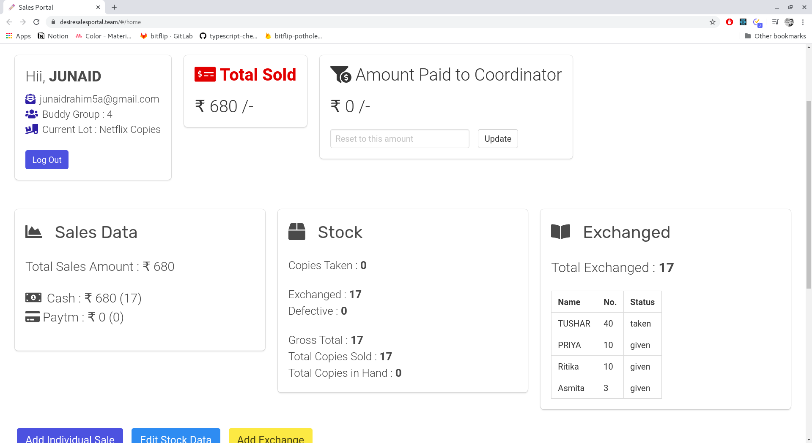

# Sales Portal for Desire Foundation

This is a portal to log and manage the sales data of [Desire Foundation](http://desirefoundation.org/). 
Previous method had a lot of intermediaries and was prone to errors. 
This project aims to streamline the data management process.

  

## Build Status

## Tools Used

* The database and authentication is handled by **Firebase**. 
* The UI is developed in **React**. 
* **Bulma** is used for CSS components

live at https://desiresalesportal.team

## Workflow
* Pull Requests and code for new features go in the `development` branch.
* Pull Requests merged to `master` from `development` are built and deployed to production.

## Screenshots

## LICENSE
Copyright (c) **Junaid H Rahim**. All rights reserved.

